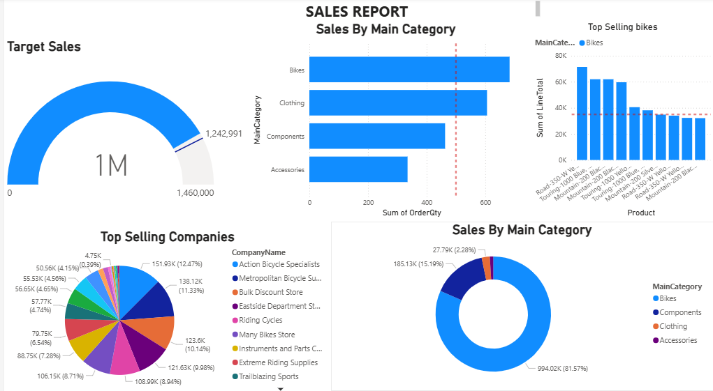

# 📊 Sales Dashboard — Power BI

> An end-to-end interactive Sales Analytics Dashboard built in Microsoft Power BI, featuring geographic sales mapping, product performance analysis, and KPI tracking.

---

## 🖼️ Dashboard Preview

---

## 📌 Project Overview

This dashboard was designed to give business stakeholders a clear, interactive view of sales performance across products, regions, and companies. It transforms raw sales data into actionable insights through compelling visualizations.

---

## 📄 Dashboard Pages

### Page 1 — Sales Performance Overview
| Visual | Description |
|--------|-------------|
| 🟡 **Gauge Chart** | Tracks actual sales vs. target sales — instant KPI visibility |
| 🥧 **Pie Chart** | Top-selling companies by revenue contribution |
| 📊 **Clustered Bar Chart** | Sales breakdown by main product category |
| 🍩 **Donut Chart** | Category-level sales share for quick comparison |
| 📈 **Clustered Column Chart** | Top-selling bike models ranked by performance |

### Page 2 — Geographic Sales Analysis
| Visual | Description |
|--------|-------------|
| 🗺️ **World Map** | Global sales distribution by city |
| 📍 **State Map** | Regional sales breakdown at the state level |

---

## 🛠️ Tools & Technologies

| Tool | Usage |
|------|-------|
| **Microsoft Power BI Desktop** | Dashboard development & visualization |
| **Power Query (M Language)** | Data transformation & cleaning |
| **DAX (Data Analysis Expressions)** | Calculated measures & KPIs |
| **Bing Maps Integration** | Geographic sales visualization |

---

## 💡 Key Features

- ✅ **KPI Gauge** — Instantly shows how close sales are to the target
- ✅ **Multi-dimensional analysis** — By product, company, category, city, and state
- ✅ **Interactive filters** — Cross-filtering across all visuals on each page
- ✅ **Geographic intelligence** — World and state-level maps for territory analysis
- ✅ **Clean layout** — Business-ready design suitable for executive reporting

---

## 📂 Repository Structure

```
📦 sales-dashboard
 ┣ 📊 SALES_DASHBOARD.pbix    ← Main Power BI file
 ┗ 📄 README.md               ← Project documentation (this file)
```

---

## 🚀 How to Open

1. Download and install [Power BI Desktop](https://powerbi.microsoft.com/desktop/) (free)
2. Clone or download this repository
3. Open `SALES_DASHBOARD.pbix` in Power BI Desktop
4. Explore the two dashboard pages using the tabs at the bottom

---

## 🎯 Business Questions This Dashboard Answers

- Which companies are driving the most revenue?
- Are we on track to hit our sales target?
- Which product categories and bike models are top performers?
- Where in the world are we generating the most sales?
- Which states or regions are underperforming?

---

## 👤 About

Built as part of a data analytics portfolio to demonstrate proficiency in Power BI, data visualization, and business intelligence storytelling.

**Skills demonstrated:** Power BI · DAX · Power Query · Data Visualization · KPI Design · Geographic Mapping · Business Intelligence

---

⭐ *If you found this project useful, feel free to star the repository!*
